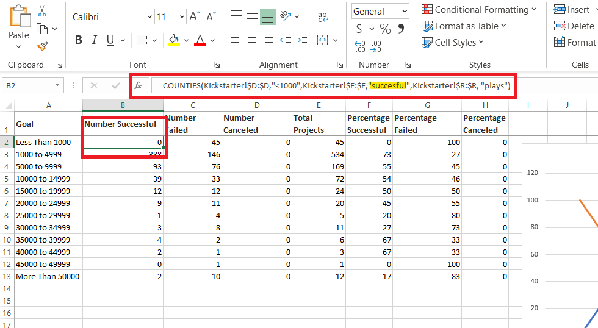
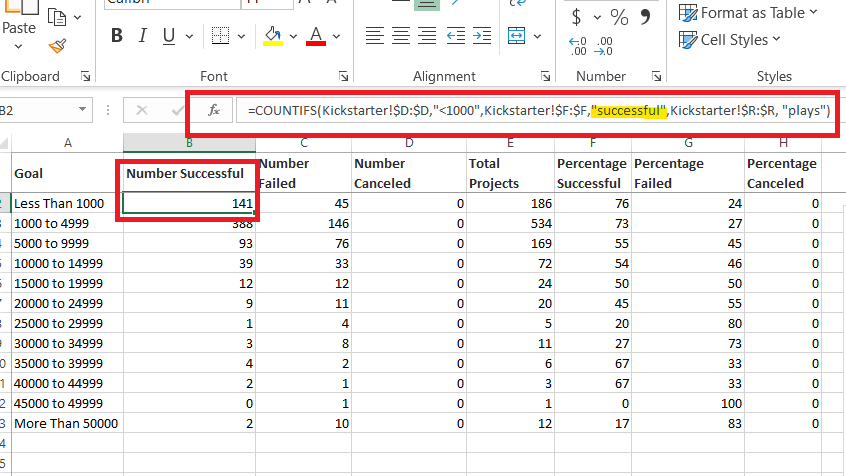

# Kickstarter Analysis: _Action!_

## Overview of Project
Helping client, Louise, identify and unearth trends on a dataset consisting of over 4,000 Kickstarter campaigns, ranging across various Media and Entertainment Arts branches, where findings would aid in decisions that can be implemented in future fundraising efforts, with the use of Excel to perform the former data analysis and create visual elements, i.e. charts, graphs and pivot tables. 
Equally, the purpose of this project was to not only look at the data at large, to answer questions, but to provide insights on a minute level on a case-by-case scenario.  
## Analysis and Challenges
When dealing with large datasets, challenges are often imminent, if not solely inevitable. This does not translate to be a bad thing—it, instead presents an opportunity to really zero in and find the best possible solutions on just how to evaluate this data. 
Challenges can come in an array of forms, from diffuclty understanding and executing the proper formula to filtering the “wrong” data (data not to pertinent to the question at hand) or, data becoming scattered from filtering, errors like typos, understanding what is needed from the presented dataset (_What **is it**  we really want to know?_).

* _Remedies for Challenges_:
  * Before starting analysis, make a copy of the original "untreated" data set and save it as a REF (reference) file 

  * Double check for typos that may yield an error when using a formula 
     * _For example,_ If you are using a formula such as, =COUNTIFS(), to reference a column containing the data value “successful”, but the input was “succesful” (typo) in the formula you may get an error

   **ERROR INPUT**
 =COUNTIFS (Kickstarter!$D:$D,"<1000",Kickstarter!$F:$F,"succesful",Kickstarter!$R:$R, "plays")
 

       
   **CORRECT INPUT** 
=COUNTIFS (Kickstarter!$D:$D,"<1000",Kickstarter!$F:$F,"successful",Kickstarter!$R:$R, "plays")

  
 * Reference educational resources for quick refreshers
 
 * Dissect the questions asked, look for clues

## Results
  ### Analysis of Outcomes Based on Launch Date
  Based on the results presented in Theater Outcomes by Launch Date analysis, it would appear:
   1.	Fundraising campaigns launched in May were most successful, with June not too far behind. 
   2.	On average 3 campaigns were canceled out of 1369 play fundraisers launched. 

  ### Analysis of Outcomes Based on Goals
  Based on the results presented in Outcomes Based on Goals analysis, it would appear:
   1.	The most successful campaigns were where the goal target was less than $5,000.

  ### Summary: Final Thoughts
   * While analysis data of past outcomes offer a glimpse in what we can maybe expect, and ultimately what the next steps should be, it could pose limitations, as the analysis is  _only_  reflective of a sample set up to a certain point in time.  
  * In addition to illustrating the outcome of data in line charts, other visual aids or chart types, such as column cluster, pie, line with markers, stacked bar would be equally effective at showcasing a clean, straightforward analysis. 

#### Author
Whitney Gardner
